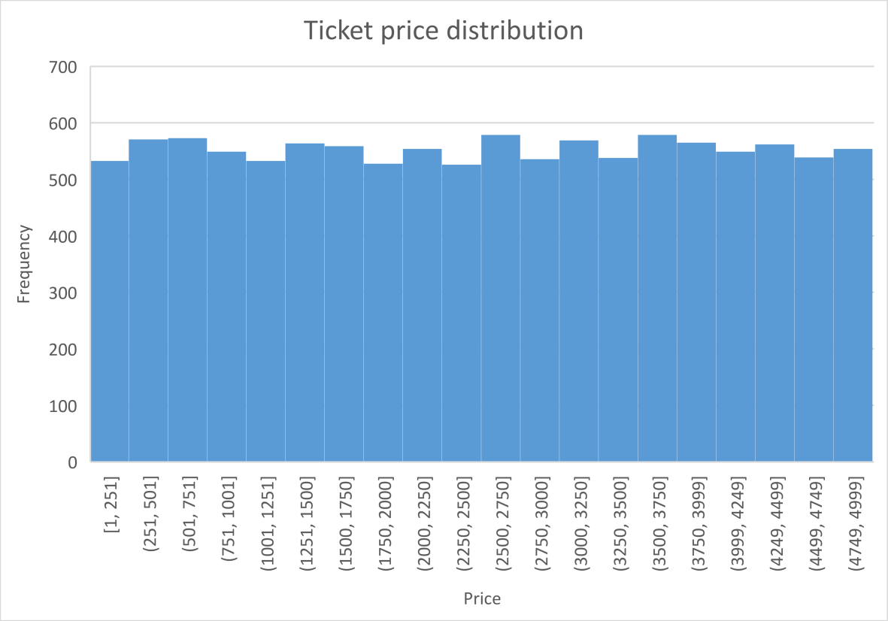
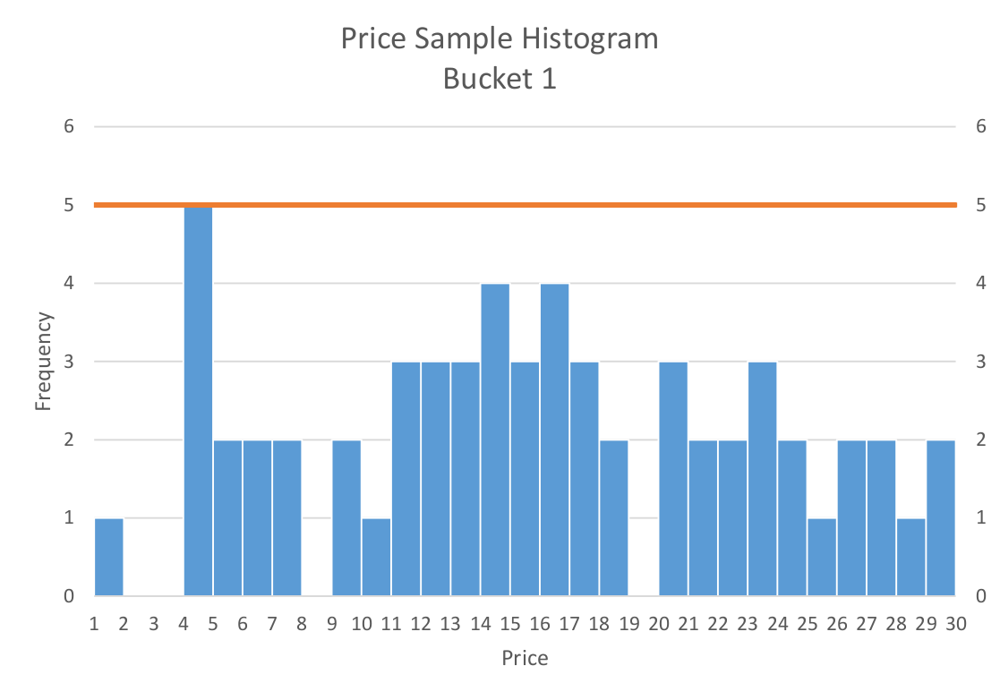
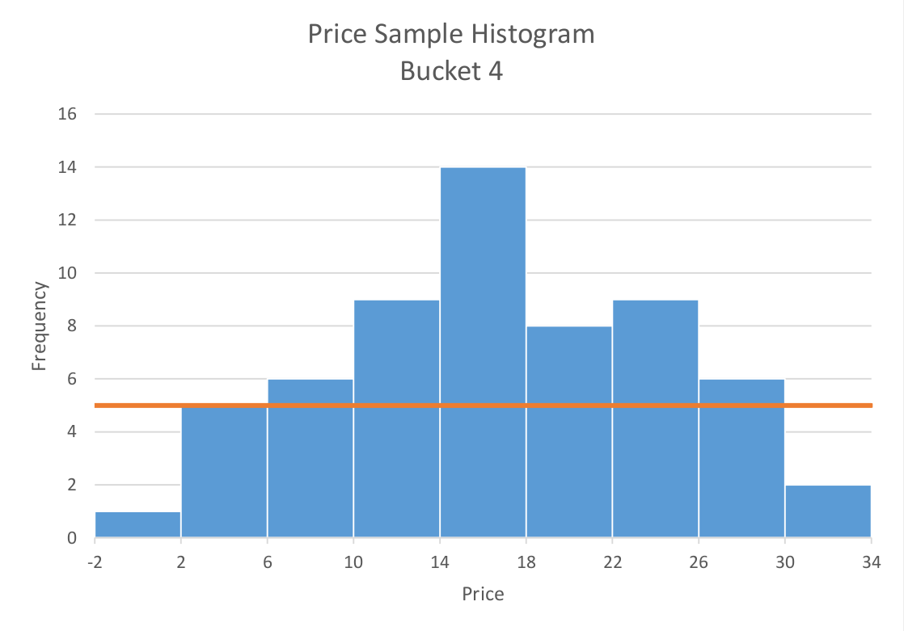
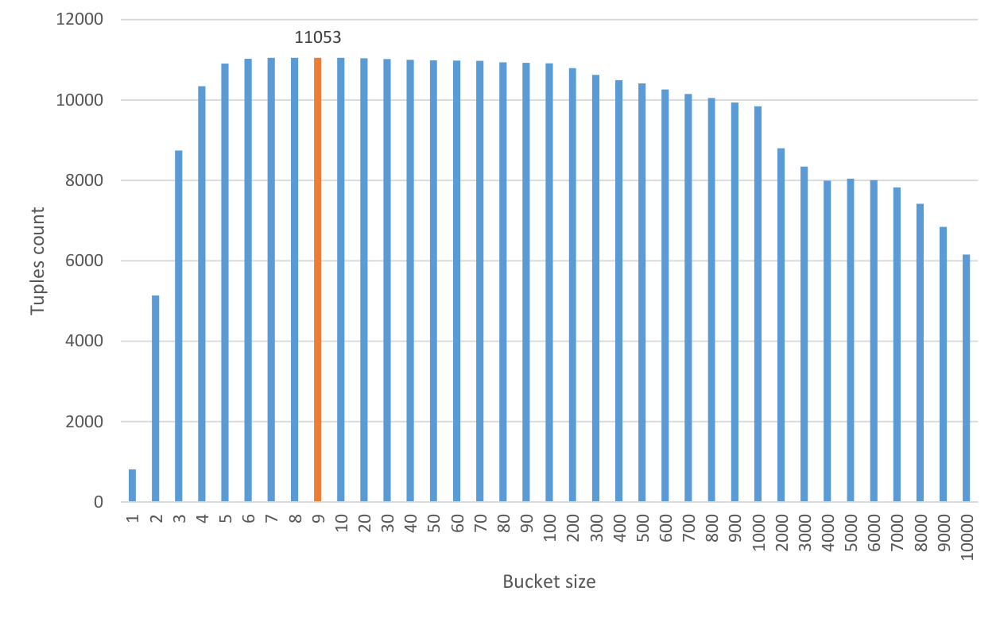
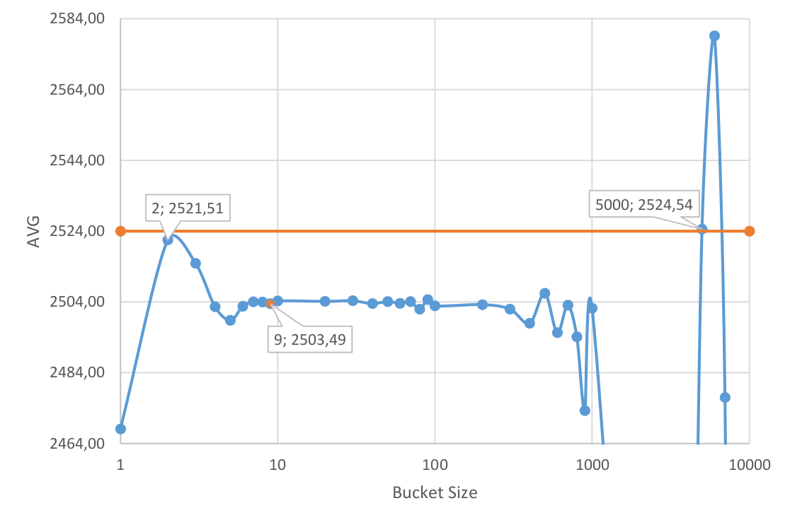

# Data anonymization
Data anonymization app implemented in Erlang with Rebar3. It is able to parse input data set, anonymize it and then compute various statistics. The specific problem and the implemented solution are described in detail below.


## Usage
To compile: `rebar3 compile`

To run tests: `rebar3 eunit`

Use `rebar3 shell` to open up Eshell with all dependencies loaded.

Tested using ERTS 13.1.4 (Erlang/OTP 25)


## Docs
Module documentation is available in `/doc/`, generated with `rebar3 edoc`.


# The problem
A dataset containing a set of user ID's is given. Associated with each user id is one or more purchases. The goal is to calculate the following statistical properties of the airline ticket purchase prices across all users, in a way that doesn't violate the privacy of the individuals in the dataset:
- the `min` and `max` purchase price
- the `average` and `median` purchase price

The actual real (unanonymized) values in the underlying dataset are:
- `min`: 1
- `max`: 100000
- `average`: 2524
- `median`: 2521


## Constraints
### Per user isolation
Data for each user must be processed in isolation from data about other users. More concretely, this means that given users `A` and `B`, when processing the data of `B` after having processed the data of user `A`, there is no recollection of what user `A`'s data looked like, or what has been reported about user `A`.


### Per user reports
The data reported about a user should take the form of tuples. Any particular tuple can be reported exactly zero or one time per user.

For example, the following three tuples are ok:
| first | second    |
|-------|-----------|
| likes | green     |
| likes | spinach   |
| likes | ice-cream |

Whereas the following are not:
| first | second |
|-------|--------|
| likes | green  |
| likes | green  |
| likes | green  |
| likes | green  |

They should instead be treated as a single occurrence of the tuple `(likes, green)`.


### Aggregation and anonymization
When processing the results from the calculations over the individual users, the following two steps must be performed before applying any further post-processing:

1. __Aggregation__: Count how many times an individual tuple occurs. The results should be a triplet `(first, second, count)`, where the `count` represents how many distinct users reported the particular tuple.
1. __Anonymization__: After aggregation all triplets with __a count of 5 or less__ should be removed.

Processing and mangling the results of the anonymization steps is permitted in order to get the desired statistical properties.

## Example
Assuming we have a dataset of users and the city in which they live. We want to discover how many users live in each city. The process would be the following:

| User id | City      |
|---------|-----------|
| 1       | Berlin    |
| 2       | Berlin    |
| 3       | Berlin    |
| 4       | Berlin    |
| 5       | Berlin    |
| 6       | Berlin    |
| 7       | Zagreb    |
| 8       | Bucharest |
| 9       | Bonn      |
| 10      | K-town    |
| 11      | K-town    |

For each user report the tuple `(city, <CITY-NAME>)`, for example `(city, Berlin)`,
`(city, Zagreb)`, etc.

After the aggregation step, the data would look like:
| key  | value     | count |
|------|-----------|-------|
| city | Berlin    | 6     |
| city | Zagreb    | 1     |
| city | Bucharest | 1     |
| city | Bonn      | 1     |
| city | K-town    | 2     |

Which after the anonymization step ends up as:
| key  | value     | count |
|------|-----------|-------|
| city | Berlin    | 6     |

In this case, the only information that could be actually reported to and end-user would be that 6 people live in
Berlin, and that there might, or might not, be people living in other cities, but it cannot be really said whether that is the case or not.


## Input data
Example input data is in the `data` folder. There is one file per individual user in the dataset. The file name is the user id. The contents of the file is a JSON dict with the following general form:

```json
{
  "purchases": [
    {"type": "airline", "amount": 100},
    {"type": "restaurant", "amount": 25},
    {"type": "coffee", "amount": 2},
    {"type": "airline", "amount": 250}
  ]
}
```

## Goal
The goal is to process and anonymize the data in such a way that the `min`, `max`, `average`, `median` stats are as close to the actual (unanonymized) values as possible. 

# Solution
## Minimal approach
By implementing the requirements given in [Constraints](#constraints) (i.e. deduplication, aggregation, anonymization), the following statistics can be derived:
|      | Value     | Error |
|------|-----------|-------|
| AVG  | 2468.09   | 2.22% |
| MED  | 2549.00   | 1.11% |
| MIN  | 56.00     | 5600% |
| MAX  | 4995.00   | 95%   |

At first glance, the `AVG` and `MED` could pass as acceptable, but `MIN` and `MAX` are far off.

## Analyzing input data
In order to try and figure out where the error is introduced, the number of tuples after each processing step can be calculated:
|                           | Number of tuples |
|---------------------------|------------------|
| Raw                       | 11063            |
| After removing duplicates | 11061            |
| After anonymization       | 813              |

It can be clearly seen that a lot of tuples are removed during the anonymization step due to the `Count > 5` constraint. It makes intuitive sense that airline tickets have high degree of price variability and thus will not aggregate nicely before anonymization.



The prices are almost uniformly distributed. That is the reason why so much data is lost during the anonymization cutoff and so little during per user duplicate removal. The standard deviation is high (~1991 or ~1443 with outliers removed). Alternatively, if the dataset was closer to normal distribution, with low variance, a lot more data would be lost during duplicate removal but most of it would aggregate afterwards, causing marginal data loss when anonymizing.

To achieve better results, the data has to be grouped, much like data is grouped in histogram buckets. The point is to minimize data loss during anonymization process. In contrast, if the dataset had low variance the solution would be to add noise to the data to minimize information loss when removing per user duplicates.

To visualize the reasoning, consider ticket prices sample from range 1 - 30. The real average of the sample is 16.4. Without grouping the data, all tuples are lost during the anonymization step. If the same sample is grouped into histogram buckets of size 4, the information loss is much smaller and the anonymized average is ~18.14. The following charts show histograms of the price sample before and after grouping, the orange line represents anonymization cutoff threshold.





## Grouping per user data
The fact that the per user data has to be grouped before aggregating is now clear. The question then becomes, what bucket size should be used? When picking the bucket size, a sweet spot must be found between losing information when removing per user duplicates vs losing information when anonymizing.

Consider the following chart which shows how many user tuples are left after anonymization for different bucket sizes. The unprocessed dataset has 11063 price tuples. The highest tuple count for an anonymized dataset is 11053, highlighted in orange. This is a major increase from the 813 tuples in the initial implementation. The chart shows a steep increase between 1-10 bucket size values, then remains somewhat steady until regression begins. The decrease starts when the bucket size is too big, causing loss of tuples when removing per user duplicates. This continues until it hits a hard limit of 6155, returning 1 tuple per user (only 6155 users bought an airplane ticket). 



Consider the following chart which shows average ticket price per bucket size, the orange line is the actual reference value. The closest values are for bucket size 2 and 5000. Those values cannot be considered reliable - the averages are calculated from too little tuples. The chart clearly show that when the bucket size is too big or too small there is too little tuples to reliably calculate average (and other stats). This causes the average to fluctuate greatly, stabilizing only when enough tuples are used.



The above findings lead to believe that picking the bucket size where there are the most tuples left after anonymization is a good enough technique for this particular task and data set. More advanced methods could include dynamically applying variable bucket sizes or calculating averages over multiple bucket results.

Before data was grouped into buckets, just like in a histogram, there were two places where data could be lost: per user duplicate removal and anonymization of aggregated data. If data is grouped together, it is an additional step where per user information loss occurs but as the results show, negative impact of the trade-off is minimal. Again, if the dataset was closer to normal distribution with low variance, data grouping could lead much quicker to negative impact on the results.

## Improved solution
An improved solution adds the grouping of prices into histogram buckets of fixed size. The algorithm boils down to:
1. For each user:
    - Extract prices
    - Group the prices into histogram buckets
    - Remove duplicates
2. Aggregate
3. Anonymize
4. Calculate stats

With the above improved algorithm and bucket size of 9, the resulting stats are:
|      | Value     | Error |
|------|-----------|-------|
| AVG  | 2503.49   | 0.81% |
| MED  | 2520.00   | 0.04% |
| MIN  | 9.00      | 900%  |
| MAX  | 4995.00   | 95%   |

These results are much improved. If were were to preprocess the data set and remove some price outliers (particularly max price), the `MIN` and `MAX` could error margin could be reduced further.

Spreadsheets with stats/charts used in this readme are available in the `stats` dir.